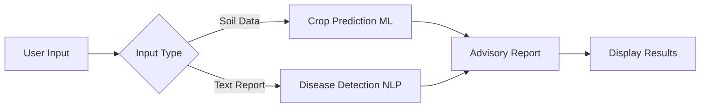

# crop-analysis-disease-prediction
Multimodal Crop Disease and Suitability Prediction using ML and NLP

<div align="center">


</div>

## 📸 **Screenshots**

### Crop Prediction Interface


### Disease Detection Dashboard


### Integrated Advisory Report


*Screenshots coming soon as development progresses*

## ⚡ **Quick Start**
```bash
# Clone the repository
git clone https://github.com/ananya-7123/crop-analysis-disease-prediction.git
cd crop-analysis-disease-prediction

# Frontend
cd frontend && npm install && npm start

# Backend (new terminal)
cd backend && npm install && npm start

# ML Pipeline (new terminal)
cd ml-pipeline-crop && python -m venv venv && source venv/bin/activate && pip install -r requirements.txt
```

**📖 For detailed setup instructions, see [Setup Guide](docs/setup-guide.md)**

## 📡 **API Endpoints**

| Method | Endpoint | Description |
|--------|----------|-------------|
| POST | `/api/crop/predict` | Predict suitable crop |
| POST | `/api/disease/analyze` | Analyze disease from text |
| GET | `/api/models/status` | Check model availability |

**Full API documentation:** [API Docs](docs/api-docs.md)

## 🔄 **System Workflow**


## 📂 **Project Structure**
```
crop-analysis-disease-prediction/
├── frontend/                 # React UI
├── backend/                  # Express API
├── ml-pipeline-crop/         # Crop prediction models
├── nlp-pipeline-disease/     # Disease detection NLP
├── datasets/                 # Dataset references only
│   ├── structured/           # Crop data sources
│   └── unstructured/         # Text data sources
├── docs/                     
│   ├── setup-guide.md        # Detailed setup instructions
│   ├── api-docs.md           # API documentation
│   └── images/               # Screenshots
└── README.md
```

⚠️ **Raw datasets and trained models are NOT committed to Git**

## ⚠️ **Important Notes**

### **What NOT to Commit:**
- ❌ Raw datasets (`datasets/*`)
- ❌ Trained model files (`.pkl`, `.joblib`, `.h5`)
- ❌ Environment files (`.env`)
- ❌ `node_modules/` or `venv/`

### **Dataset Access:**
- All datasets are publicly available (see [Datasets](#-datasets))
- Download instructions in `datasets/README.md`
- Store locally in respective folders after download

### **Model Files:**
- Train models locally using provided scripts
- Models auto-save to `ml-pipeline-crop/models/` and `nlp-pipeline-disease/models/`

## 🔧 **Troubleshooting**

| Issue | Solution |
|-------|----------|
| Port already in use | Change port in `.env` file |
| Module not found | Run `pip install -r requirements.txt` again |
| Models not loading | Run training scripts in ML pipeline folders |
| CORS errors | Check backend CORS configuration |

**For more help, see [Setup Guide](docs/setup-guide.md) or open an issue**

## 🗺️ **Roadmap**

### Phase 1: MVP Development ✅
- [x] Project setup and architecture
- [x] Dataset collection
- [x] Basic ML pipeline
- [ ] NLP pipeline completion
- [ ] Frontend-backend integration

### Phase 2: Enhancement 🔄
- [ ] Model optimization
- [ ] UI/UX improvements
- [ ] Performance testing
- [ ] Documentation completion

### Phase 3: Deployment 📦
- [ ] Cloud deployment
- [ ] CI/CD pipeline
- [ ] Monitoring setup

## 🙏 **Acknowledgments**

- **Datasets:** Kaggle, UCI ML Repository, Government of India
- **Inspiration:** Agricultural technology research papers
- **Tools:** scikit-learn, NLTK, React, Express.js
- **Mentor/Guide:** [If applicable]
- [ ] User testing

