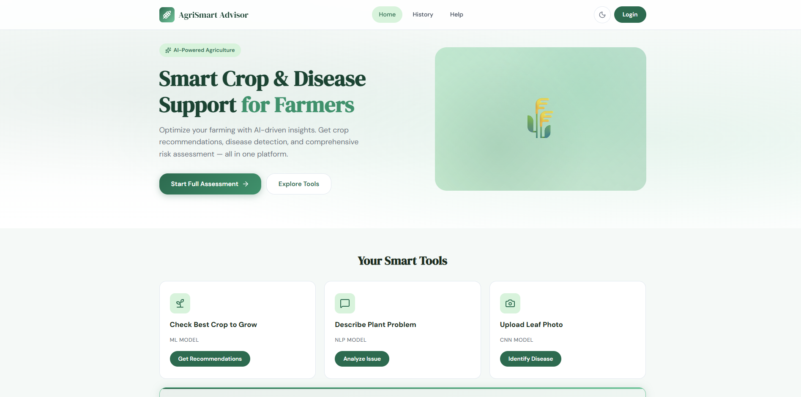
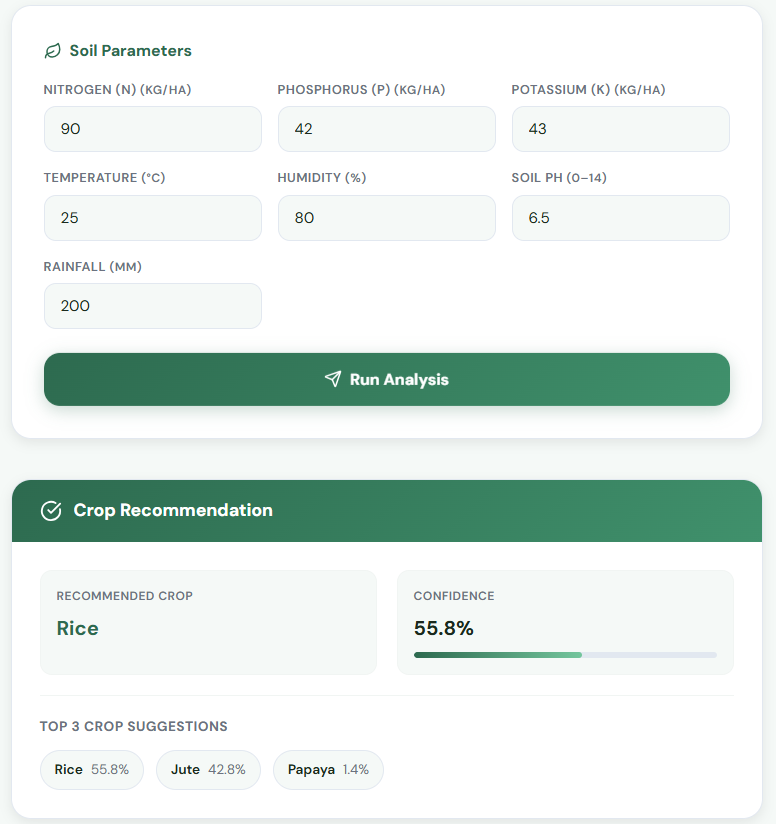
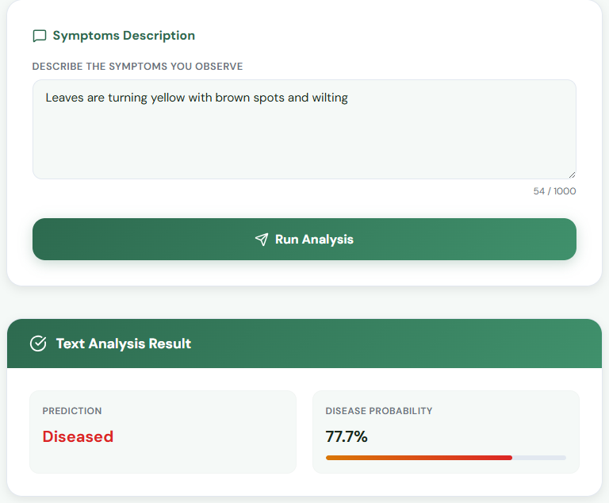
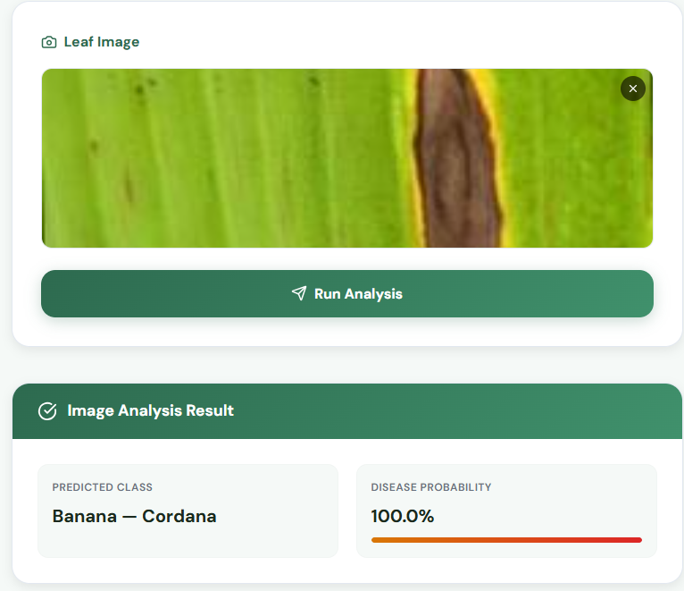
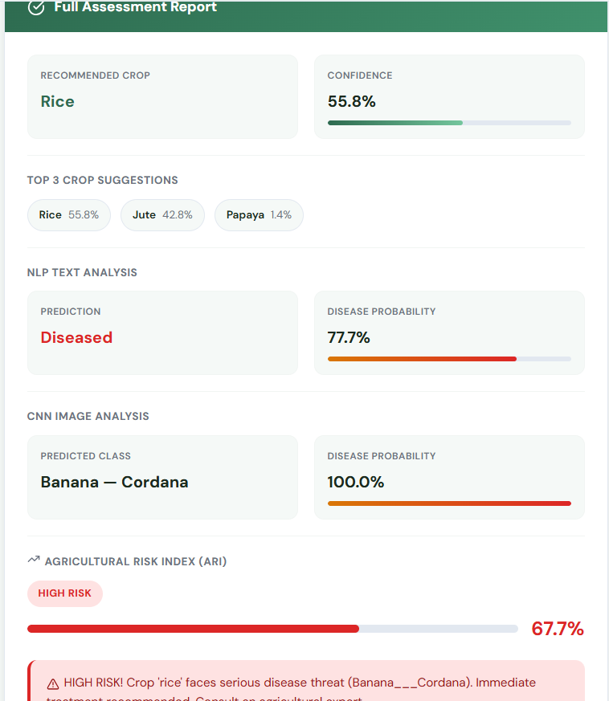

# 🌾 AgriSmart Advisor

### Multimodal Ensemble Framework for Crop Suitability and Disease Risk Assessment

> A full-stack AI-powered agricultural decision-support system integrating Machine Learning, Natural Language Processing, and Deep Learning to provide comprehensive crop recommendations and disease risk assessment.

## 📸 Screenshots

### Homepage — Overview


### ML Results


### NLP Results


### CNN Results


### ARI Full Report



## 📌 Table of Contents

- [Overview](#overview)
- [Live Demo](#live-demo)
- [Features](#features)
- [System Architecture](#system-architecture)
- [Tech Stack](#tech-stack)
- [Project Structure](#project-structure)
- [Getting Started](#getting-started)
- [Deployment](#deployment)
- [API Documentation](#api-documentation)
- [Data Sources](#data-sources)
- [How It Works](#how-it-works)

---

## Overview

AgriSmart Advisor is a trimodal intelligent agricultural system that takes three types of inputs simultaneously — **structured soil/climate data**, **farmer text reports**, and **crop leaf images** — and produces a unified **Agricultural Risk Index (ARI)** along with actionable farming advice.

The system is built around three core pipelines fused into one output:

- **ML Pipeline** — Crop suitability prediction using ensemble classical ML models
- **NLP Pipeline** — Disease risk estimation from farmer-written symptom descriptions
- **CNN Pipeline** — Plant disease classification from leaf images using transfer learning
- **Fusion Engine** — Combines all three outputs into a single risk score using the ARI formula

---

## Features

- Crop recommendation with confidence scores and top-3 suggestions
- Disease detection from text descriptions using TF-IDF + ML
- Leaf image disease classification using MobileNetV2 transfer learning
- Agricultural Risk Index (ARI) fusion across all three modalities
- Risk categorization: Low / Moderate / High with remediation advice
- User authentication via Supabase
- Assessment history tracking
- Dark mode support
- Fully responsive UI

---

## System Architecture

```
React Frontend (port 5173)
        │
        │ HTTP / fetch()
        ▼
Flask Backend (port 5000)
        │
        ▼
  Fusion Engine (fusion.py)
   ARI = α(1−C) + βD
   /          |          \
  ▼           ▼           ▼
ML Pipeline  NLP Pipeline  CNN Pipeline
(crop .pkl)  (tfidf .pkl)  (model .h5)
```

**ARI Formula:**

```
ARI = α(1 − C) + β × D

where:
  C = Crop suitability confidence (from ML pipeline)
  D = Disease probability (weighted fusion of NLP + CNN)
  α, β = tunable weights (default: α=0.4, β=0.6)
```

**Risk Levels:**
| ARI Score | Risk Level |
|-----------|------------|
| 0 – 0.33 | Low Risk |
| 0.33 – 0.66 | Moderate Risk |
| 0.66 – 1.0 | High Risk |

---

## Tech Stack

**Frontend**

- React 18 + Vite
- Supabase (auth + history)
- CSS modules

**Backend**

- Python 3.10+
- Flask + Flask-CORS

**Machine Learning**

- Scikit-learn (Random Forest, SVM, Naive Bayes, Voting Ensemble)
- TF-IDF Vectorizer (NLP disease pipeline)
- TensorFlow / Keras — MobileNetV2 transfer learning (CNN pipeline)
- Pandas, NumPy
- Joblib / Pickle (model serialization)

---

## Project Structure

```
crop-analysis-disease-prediction/
├── backend/
│   ├── app.py                  # Flask API server
│   ├── fusion.py               # ARI fusion engine
│   ├── requirements.txt
│   └── uploads/                # Temp image uploads
│
├── ml-pipeline-crop/
│   ├── 01_preprocessing.py
│   ├── 02_train_models.py
│   ├── 03_evaluate_models.py
│   └── models/
│       ├── rf_model.pkl
│       ├── svm_model.pkl
│       └── nb_model.pkl
│
├── nlp-pipeline-disease/
│   ├── 01_preprocessing.py
│   ├── 02_train_model.py
│   ├── 03_evaluate_model.py
│   └── models/
│       ├── nlp_model.pkl
│       └── tfidf_vectorizer.pkl
│
├── cnn-pipeline-disease/
│   ├── 01_preprocessing.py
│   ├── 02_train_model.py
│   ├── 03_evaluate_model.py
│   └── models/
│       └── final_model.h5
│
├── models/
│   ├── label_encoder.pkl
│   └── scaler.pkl
│
├── frontend/
│   ├── src/
│   │   ├── components/         # Reusable UI components
│   │   ├── pages/              # Home, Help, History, Auth
│   │   ├── services/           # API calls, Supabase client
│   │   ├── context/            # Auth context
│   │   └── hooks/
│   ├── .env                    # Environment variables (not committed)
│   └── vite.config.js
│
└── datasets/
    ├── images/                 # PlantVillage leaf images
    └── structured/             # Crop recommendation CSV
```

---

## Getting Started

### Prerequisites

- Python 3.10+
- Node.js 18+
- Git

### 1. Clone the repository

```bash
git clone https://github.com/your-username/crop-analysis-disease-prediction.git
cd crop-analysis-disease-prediction
git checkout final-prototype
```

### 2. Set up the backend

```bash
cd backend
pip install -r requirements.txt
```

### 3. Train the models (if .pkl / .h5 files don't exist)

```bash
# ML crop pipeline
cd ml-pipeline-crop
python 01_preprocessing.py
python 02_train_models.py
python 03_evaluate_models.py

# NLP disease pipeline
cd ../nlp-pipeline-disease
python 01_preprocessing.py
python 02_train_model.py

# CNN image pipeline
cd ../cnn-pipeline-disease
python 01_preprocessing.py
python 02_train_model.py
```

### 4. Start the backend server

```bash
cd backend
python app.py
```

Backend runs at `http://localhost:5000`

### 5. Set up the frontend

Create `frontend/.env` with your Supabase credentials:

```
VITE_SUPABASE_URL=your_supabase_project_url
VITE_SUPABASE_ANON_KEY=your_supabase_anon_key
VITE_API_BASE_URL=http://localhost:5000
```

Then install and run:

```bash
cd frontend
npm install
npm run dev
```

Frontend runs at `http://localhost:5173`

---

---

## API Documentation

### Base URL

```
http://localhost:5000
```

### Endpoints

#### `POST /predict/crop`

Crop suitability prediction from soil and climate parameters.

**Request body:**

```json
{
  "N": 90,
  "P": 42,
  "K": 43,
  "temperature": 25.0,
  "humidity": 80.0,
  "ph": 6.5,
  "rainfall": 200.0
}
```

**Response:**

```json
{
  "recommended_crop": "rice",
  "confidence": 0.558,
  "top_3": [
    { "crop": "rice", "probability": 0.558 },
    { "crop": "jute", "probability": 0.428 },
    { "crop": "papaya", "probability": 0.014 }
  ]
}
```

---

#### `POST /predict/disease/text`

Disease risk estimation from farmer text report.

**Request body:**

```json
{
  "text": "Leaves are turning yellow with brown spots and wilting"
}
```

**Response:**

```json
{
  "prediction": "Diseased",
  "disease_probability": 0.777
}
```

---

#### `POST /predict/disease/image`

Plant disease classification from leaf image.

**Request:** `multipart/form-data` with field `image` (jpg/png)

**Response:**

```json
{
  "predicted_class": "Cotton___fresh_plant",
  "disease_probability": 0.0
}
```

---

#### `POST /predict/fusion`

Full trimodal ARI assessment (all three inputs combined).

**Request:** `multipart/form-data` with fields:

- `N`, `P`, `K`, `temperature`, `humidity`, `ph`, `rainfall` (soil data)
- `text` (farmer report)
- `image` (leaf image)

**Response:**

```json
{
  "recommended_crop": "rice",
  "crop_confidence": 0.558,
  "nlp_prediction": "Diseased",
  "nlp_disease_probability": 0.777,
  "cnn_predicted_class": "Cotton___fresh_plant",
  "cnn_disease_probability": 0.0,
  "ari_score": 0.377,
  "risk_level": "Moderate Risk",
  "advisory": "Crop 'rice' shows moderate disease risk. Apply preventive treatment and monitor closely."
}
```

---

## Data Sources

| Dataset                     | Source                                                                                             | Usage                        |
| --------------------------- | -------------------------------------------------------------------------------------------------- | ---------------------------- |
| Crop Recommendation Dataset | [Kaggle – Atharva Ingle](https://www.kaggle.com/datasets/atharvaingle/crop-recommendation-dataset) | ML crop suitability pipeline |
| PlantVillage Dataset        | [Kaggle – Abdallah Ali](https://www.kaggle.com/datasets/abdallahalidev/plantvillage-dataset)       | CNN disease classification   |
| Agricultural Text Reports   | Synthetic / curated                                                                                | NLP disease risk pipeline    |

---

## How It Works

### 1. Crop Suitability (ML Pipeline)

Soil parameters (N, P, K, temperature, humidity, pH, rainfall) are fed into an ensemble of Random Forest, SVM, and Naive Bayes classifiers trained on 2,200 labeled crop samples. The ensemble uses a voting strategy to produce a final crop recommendation with confidence score `C`.

### 2. Disease Risk from Text (NLP Pipeline)

Farmer symptom descriptions are vectorized using TF-IDF and classified by a trained ML classifier into Healthy / Diseased, producing a disease probability score.

### 3. Disease Classification from Image (CNN Pipeline)

Leaf images are classified using a MobileNetV2 model fine-tuned on the PlantVillage dataset (38 disease classes). The output is a disease class label and probability score.

### 4. ARI Fusion

The crop confidence `C` and weighted disease probability `D` (from NLP + CNN) are combined:

```
ARI = α(1 − C) + β × D
```

A high ARI means the crop is unsuitable AND there is high disease risk — the farmer needs urgent intervention. A low ARI means a good crop match with low disease risk.

---

## Notes

- The `.env` file is not committed to Git. You must create it manually on each machine.
- Sklearn version warnings on model load are non-breaking and can be ignored.
- CNN model training requires a GPU for reasonable speed; CPU training is slow but works.
- The `uploads/` folder in backend stores temporary image files during inference and can be cleared anytime.
